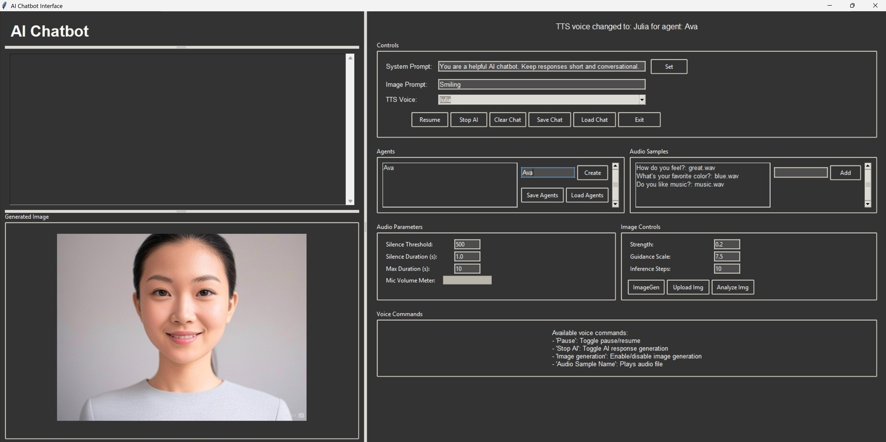

## Overview
This is an basic AI chatbot interface designed to handle various text-to-speech (TTS) functionalities and image generation based on user interactions. It uses the F5 TTS engine and can handle responses in multiple emotions. The LLM can be hosted using LM Studio or Ollama and supports current vision LLM models

## Features
- **Multi-Agent Support:** Switch between different agents with unique personalities and styles. Note: Using multiple emotions requires the system prompt to be set to return the emotion tag. 
- **Text-to-Speech Integration:** Generate audio responses from text using various TTS models.
- **Speech-to-Text Integration:** Capture audio input using OpenAI Whisper.
- **Image Generation:** Create visual representations of the chatbot in different styles based on prompt using Stable Diffusion.
- **User-Friendly Interface:** A graphical user interface (GUI) for easy interaction.

## Requirements
- Python 3.x
- LM Studio or Ollama hosting the LLM
- Stable Diffusion \ LoRA checkpoints (e.g. https://civitai.com/) 
- PyTorch
- F5 TTS (https://github.com/SWivid/F5-TTS/tree/main/src/f5_tts) and your own audio files. The examples provided are just AI created. 
- Other dependencies listed in `requirements.txt`

## Installation

1. Clone the repository:
   ```bash
   git clone https://github.com/drank10/AnotherChatbot.git
   cd AnotherChatbot
   ```

2. Install dependencies:
   ```bash
   pip install -r requirements.txt
   ```

3. Run the program:
   ```bash
   python main.py
   ```

## Usage

1. **Select an Agent:** Choose or create a new agent from the interface. Agents can either be a single emotion or multiple. Please see F5 TTS documention for more details. When creating an agent, you will be prompted for their image file and can select their TTS voice which can then be saved for future use.  
2. **Start Chatting:** The agent will enter a listening mode.
3. **Pause/Unpause:** Use the 'p' key to pause/unpause the conversation.
4. **Image Generation:** Download a Stable Diffusion checkpoint and LoRA of your choice. Use the 'i' key to enable/disable image generation. 

## Customization
- You can modify the TTS models, system prompts, and other settings through the interface or by editing the source code.
- Different models of STT (Whisper Tiny), LLM, and inference steps can be used to adjust performance and used VRAM.
- Output image to webserver so avatar can be displayed on any browser using Chatbot_web.py
- Servo can be controlled when chatbot starts or stops speaking (Chatbot_servo.py) using an ESP8266 or ESP32 and WebServo.py micropython
- Coqui TTS can be used for fast responses without voice cloning in OldTTSBot.py

## Contributing

Feel free to fork this repository and submit pull requests! If you encounter any issues, please create an issue on GitHub.

## License

This project is licensed under the MIT License. See the [LICENSE](LICENSE) file for more details.
```
